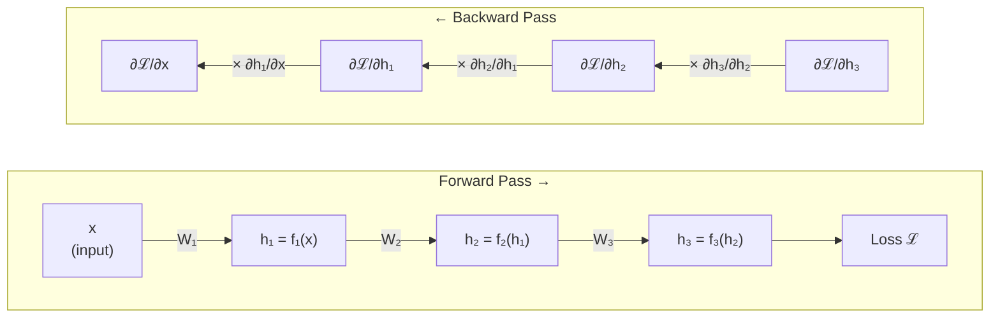

# Backpropagation

> The algorithm that makes training deep neural networks feasible — it computes gradients of the loss with respect to every parameter in a single backward pass, by applying the chain rule layer-by-layer from output to input.

## Overview

Without backpropagation, deep learning as we know it would not exist. A neural network may have millions or billions of parameters, and training requires knowing how each one affects the [[loss-functions|loss]]. Computing these gradients one parameter at a time (via finite differences or forward-mode differentiation) would cost proportional to the number of parameters — completely infeasible for modern networks. Backpropagation computes *all* gradients in a single backward pass at roughly twice the cost of the forward pass. This efficiency is what makes [[gradient-descent]]-based training of deep networks practical, and it is the reason every major deep learning framework is built around it.

The core problem backpropagation solves is *credit assignment*: given that a network produced an incorrect output, how much did each individual parameter contribute to the error? The answer is the gradient — the partial derivative of the loss with respect to each parameter.

The algorithm works by exploiting the chain rule of calculus. A neural network is a composition of functions: $f = f_L \circ f_{L-1} \circ \cdots \circ f_1$. The gradient of the loss with respect to parameters in layer $l$ depends on the gradients flowing back from all subsequent layers. Backpropagation computes these gradients efficiently by working backward from the loss, reusing intermediate results at each layer rather than recomputing them — the key insight of reverse-mode automatic differentiation.

In modern practice, backpropagation is implemented automatically by deep learning frameworks through *automatic differentiation* (autograd). The programmer defines the forward computation, and the framework records a computational graph of operations. When `.backward()` is called on the loss, the framework traverses this graph in reverse, applying the chain rule at each node. This eliminates the error-prone manual derivation of gradients and makes it trivial to experiment with novel architectures.

## Key Details

### Intuition

Imagine a factory assembly line with many stations. A defective product comes out at the end. To fix the problem, you work backward through the line: the last station tells you what it received and how it transformed it, which lets you figure out what went wrong at the second-to-last station, and so on. Each station only needs to know how its local operation affected the output and what error signal it received from downstream. Backpropagation is exactly this — passing blame backward through the layers.

### Etymology & History

The term "backpropagation" is short for "backward propagation of errors." The mathematical foundation — reverse-mode automatic differentiation — was first described by Seppo Linnainmaa in his 1970 master's thesis. Paul Werbos applied the idea to neural networks in his 1974 PhD thesis, but it remained obscure. The technique became widely known through the landmark 1986 *Nature* paper by David Rumelhart, Geoffrey Hinton, and Ronald Williams, "Learning representations by back-propagating errors," which demonstrated that backpropagation could train multi-layer networks to learn useful internal representations. This paper is often cited as the moment deep learning became viable.

### The Chain Rule

For a composition $L = \mathcal{L}(f_L(f_{L-1}(\cdots f_1(x) \cdots)))$, the chain rule gives:

$$\frac{\partial L}{\partial w_l} = \frac{\partial L}{\partial h_L} \cdot \frac{\partial h_L}{\partial h_{L-1}} \cdots \frac{\partial h_{l+1}}{\partial h_l} \cdot \frac{\partial h_l}{\partial w_l}$$

where $h_l$ is the output of layer $l$ and $w_l$ are its parameters. Each factor $\frac{\partial h_{l+1}}{\partial h_l}$ is the *Jacobian* of layer $l+1$ — the matrix of all partial derivatives of $h_{l+1}$ with respect to $h_l$, describing how each element of the input affects each element of the output. For a linear layer $h_{l+1} = W h_l$, the Jacobian is simply the weight matrix $W$ itself. For an element-wise activation like ReLU, the Jacobian is a diagonal matrix of the per-element derivatives.

### Forward and Backward Passes

**Forward pass**: compute the output layer by layer, storing intermediate activations:

$$h_0 = x, \quad h_l = f_l(h_{l-1}; w_l) \quad \text{for } l = 1, \ldots, L, \quad L = \mathcal{L}(h_L, y)$$

**Backward pass**: compute gradients layer by layer from output to input:

$$\delta_L = \frac{\partial \mathcal{L}}{\partial h_L}, \quad \delta_{l-1} = \delta_l \cdot \frac{\partial h_l}{\partial h_{l-1}}, \quad \frac{\partial L}{\partial w_l} = \delta_l \cdot \frac{\partial h_l}{\partial w_l}$$

The vector $\delta_l$ is the gradient of the loss with respect to the activations of layer $l$, often called the *error signal* at that layer. It is computed once and used both to compute the parameter gradients and to propagate the signal further backward.

**Example: forward and backward through a 3-layer network:**

At each layer $l$, the parameter gradient $\frac{\partial \mathcal{L}}{\partial w_l}$ is computed from the backward-flowing error signal $\delta_l$ and the stored forward activation $h_{l-1}$.

### Computational Graph and Autograd

Modern frameworks represent the computation as a directed acyclic graph (DAG) where:
- **Nodes** are operations (matmul, add, relu, etc.)
- **Edges** are tensors flowing between operations

Each operation defines two functions:
1. **Forward**: compute the output from inputs
2. **Backward** (the "vector-Jacobian product" or VJP): given the gradient of the loss w.r.t. the output, compute the gradient w.r.t. each input

The backward pass traverses this graph in topological reverse order, accumulating gradients over [[tensors]]. This is *reverse-mode automatic differentiation* — distinct from numerical differentiation (finite differences, which is slow and inaccurate) and symbolic differentiation (which produces unwieldy expressions).

### Vanishing and Exploding Gradients

When the gradient passes through many layers, it is multiplied by the Jacobian of each layer. If these Jacobians consistently have singular values less than 1, the gradient shrinks exponentially — the *vanishing gradient problem*. If they have singular values greater than 1, the gradient grows exponentially — the *exploding gradient problem*.

**Vanishing gradients** are particularly problematic because they cause early layers to learn extremely slowly. This was the main obstacle to training deep networks before modern solutions. The saturating nature of sigmoid and tanh [[activation-functions]] worsened the problem, since their derivatives approach zero for large inputs.

**Exploding gradients** can be mitigated by *gradient clipping*: rescaling the gradient vector when its norm exceeds a threshold.

Key architectural solutions:
- **[[activation-functions|ReLU activations]]**: gradient is exactly 1 for positive inputs, avoiding saturation
- **[[skip-connections|Skip connections]]**: provide an alternative gradient path that bypasses layers entirely
- **[[normalization-techniques|Normalization layers]]**: keep activations in a well-conditioned range
- **[[neural-network-initialization|Careful initialization]]**: Xavier/He initialization scales weights to maintain gradient magnitude

### Backpropagation Through Time (BPTT)

For [[recurrent-neural-networks]], backpropagation is applied by first "unrolling" the recurrence across time steps, producing a very deep feedforward graph with shared weights. Gradients are then computed by standard backpropagation through this unrolled graph — hence "backpropagation through time." The shared weights mean that parameter gradients are accumulated across all time steps. BPTT made the vanishing gradient problem especially severe in RNNs: unrolling hundreds of time steps creates an extremely deep chain of Jacobian products. This motivated gated architectures (LSTM, GRU) that provide gradient highways through time, and ultimately the shift to [[attention-and-transformers|Transformers]], which avoid sequential gradient chains entirely via attention.

*Truncated BPTT* limits the backward pass to a fixed number of steps, trading gradient accuracy for bounded memory and compute — a practical necessity for long sequences.

### The Adjoint Method and Continuous Backpropagation

[[neural-odes-and-continuous-models|Neural ODEs]] recast backpropagation in continuous time. Instead of propagating gradients through discrete layers, the *adjoint method* solves an ODE backward in time to compute gradients of the loss with respect to the parameters of the continuous dynamics. This is mathematically equivalent to reverse-mode autodiff in the limit of infinitely many infinitesimally small layers. The adjoint method has constant memory cost (independent of the number of integration steps), making it attractive for very deep or continuous-depth models. Flow matching — now used in [[diffusion-models|Stable Diffusion 3]] and Flux — builds on this continuous-time perspective.

### Memory Requirements

The backward pass requires the intermediate activations from the forward pass (since $\frac{\partial h_l}{\partial w_l}$ depends on $h_{l-1}$). This means all activations must be stored in memory during training, which is a major memory bottleneck. For a model with $L$ layers processing a batch of $B$ samples, the activation memory scales as $O(B \cdot L \cdot D)$ where $D$ is the typical layer width.

*Gradient checkpointing* (also called *activation checkpointing* or *rematerialization*) trades memory for compute by discarding some activations during the forward pass and recomputing them during the backward pass, reducing memory from $O(L)$ to $O(\sqrt{L})$ at the cost of one additional forward pass.

## Learn

- [The Math of Backpropagation](../teach/backpropagation/index.html) — interactive walkthrough: partial derivatives refresher, chain rule with numbers, full forward/backward pass by hand, and how autograd works under the hood (with step-through of every primitive operation)
- [Vanishing & Exploding Gradients](../teach/backpropagation/vanishing-gradients.html) — simulation: change depth, activation function, initialization, skip connections, and layer normalization — watch gradient magnitudes per layer respond in real time

## Connections

- [[gradient-descent]] — consumes the gradients computed by backpropagation to update parameters
- [[activation-functions]] — their derivatives determine how gradients flow; ReLU mitigates vanishing gradients
- [[skip-connections]] — provide shortcut gradient paths that bypass potentially gradient-killing layers
- [[tensors]] — autograd operates on tensor computational graphs
- [[loss-functions]] — the starting point of the backward pass
- [[normalization-techniques]] — keep activations in a well-conditioned range, stabilizing gradient magnitudes across layers
- [[neural-network-initialization]] — Xavier/He initialization is specifically designed to maintain gradient magnitude during backpropagation; bad initialization causes vanishing or exploding gradients before training even begins
- [[recurrent-neural-networks]] — BPTT unrolls recurrence into a deep chain, making vanishing gradients especially severe and motivating LSTM/GRU gating
- [[neural-odes-and-continuous-models]] — the adjoint method is continuous-time backpropagation, computing gradients by solving an ODE backward in time

## Sources

- Linnainmaa, S. (1970). "The representation of the cumulative rounding error of an algorithm as a Taylor expansion of the local rounding errors." Master's thesis, University of Helsinki.
- Rumelhart, D., Hinton, G. & Williams, R. (1986). "Learning representations by back-propagating errors." *Nature*, 323, 533–536.
- Fleuret, F. (2023). *The Little Book of Deep Learning*. Chapter 3.4.
- Baydin, A.G. et al. (2018). "Automatic Differentiation in Machine Learning: A Survey." *JMLR*.

## Open Questions

- Can forward-mode differentiation or other alternatives to backpropagation become competitive?
- Is backpropagation biologically plausible? The brain doesn't seem to have a mechanism for propagating error signals backward through synapses.
- How do alternatives like "feedback alignment" (Lillicrap et al., 2016) or "forward-forward" (Hinton, 2022) compare at scale?
- What is the theoretical minimum memory requirement for computing exact gradients?
