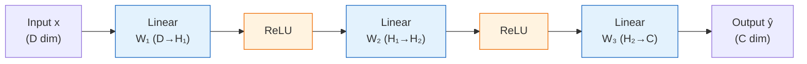

# Multi-Layer Perceptrons

> The simplest deep architecture — a stack of fully connected linear layers separated by activation functions — and the theoretical foundation proving that neural networks can approximate any continuous function.

## Overview

The Multi-Layer Perceptron (MLP) is the most basic form of a deep neural network: a sequence of *fully connected* (or *dense*) layers, each followed by a non-linear activation function. A fully connected layer with weight matrix $W$ of size $D' \times D$ and bias vector $b$ of size $D'$ computes the affine transformation $Y = WX + b$, mapping an input of dimension $D$ to an output of dimension $D'$. Note that, as Fleuret points out, "the term 'linear' in deep learning generally refers improperly to an affine operation" — a true linear mapping would have no bias.

Despite their simplicity, MLPs carry profound theoretical significance. The *Universal Approximation Theorem* (Cybenko, 1989) states that a single hidden layer MLP with a continuous, non-polynomial activation function can approximate any continuous function on a compact domain to arbitrary precision. This means that even a two-layer network is, in principle, a universal function approximator. The practical limitation is that the hidden layer may need to be arbitrarily wide, and a single wide layer may be far less efficient than a deeper network.

In modern deep learning, pure MLPs are rarely used as complete architectures because they cannot efficiently handle high-dimensional structured inputs like images. However, MLPs are ubiquitous as *sub-components*: the feed-forward block inside every Transformer is a two-layer MLP, the classifier head of a CNN is typically an MLP, and MLPs serve as projection layers throughout modern architectures.

## Key Details

### Intuition

An MLP is like a pipeline of simple decision-makers. Each layer transforms the data — stretching, rotating, and shifting it in a high-dimensional space — and the activation function between layers introduces bends and folds. Together, these transformations progressively reshape the data until the classes or targets become easy to distinguish. A single layer can only draw a linear boundary; stacking layers with non-linearities creates arbitrarily complex decision boundaries.

### Etymology & History

The "perceptron" was invented by Frank Rosenblatt in 1958 at the Cornell Aeronautical Laboratory — a single-layer linear classifier inspired by biological neurons. The name combines "perceive" with the suffix "-tron" (common in 1950s electronics, from "electron"). Rosenblatt's perceptron could only solve linearly separable problems, a limitation famously highlighted by Minsky and Papert in their 1969 book *Perceptrons*, which contributed to the first "AI winter." The "multi-layer" prefix was added when researchers showed that stacking perceptrons with hidden layers overcomes this limitation. The term "MLP" became standard in the 1980s–90s after backpropagation made training multi-layer networks practical.

### Architecture

**A 3-layer MLP** — input passes through alternating linear transformations and non-linear activations:

An MLP with $L$ hidden layers takes the form:

$$h_0 = x$$
$$h_l = \sigma(W_l h_{l-1} + b_l) \quad \text{for } l = 1, \ldots, L$$
$$\hat{y} = W_{L+1} h_L + b_{L+1}$$

where $\sigma$ is the activation function (typically ReLU or GELU), and the final layer has no activation (producing raw logits for classification or continuous values for regression).

The "depth" of the model is conventionally the number of hidden layers (excluding the output layer).

### Fully Connected Layers

A fully connected layer implements:

$$\forall d_1, \ldots, d_K, \quad Y[d_1, \ldots, d_K] = W X[d_1, \ldots, d_K] + b$$

For a batch of $N$ samples with $D$-dimensional input mapped to $D'$-dimensional output:
- **Parameters**: $D' \times D + D'$ (weights + biases)
- **Computation**: $N \times D' \times D$ multiply-adds

The parameter count scales quadratically with the layer dimensions, which is why fully connected layers are impractical for high-dimensional inputs. A single fully connected layer on a $256 \times 256$ RGB image would require $3 \times 256^2 \approx 200{,}000$ input dimensions — even mapping to the same size would need $\sim 4 \times 10^{10}$ parameters.

### Universal Approximation Theorem

**Theorem** (Cybenko, 1989; Hornik et al., 1989): Let $\sigma$ be a continuous, non-polynomial activation function. For any continuous function $f$ on a compact domain and any $\epsilon > 0$, there exists an MLP with one hidden layer:

$$g(x) = l_2 \circ \sigma \circ l_1(x)$$

where $l_1$ and $l_2$ are affine transformations, such that $|g(x) - f(x)| < \epsilon$ for all $x$ in the domain.

**Constructive intuition**: The proof becomes visual with sigmoid activations. A single sigmoid neuron with a large weight produces a near-step function that "turns on" at a specific input value. A pair of neurons — one stepping up, one stepping down — creates a localized bump of a chosen height and position. By combining many such bumps (one per hidden neuron), the network tiles the input domain with adjustable rectangular pulses that approximate any target function to arbitrary precision. For multi-dimensional inputs, the same principle extends: each neuron defines a hyperplane step, and combinations of neurons carve out localized regions in input space whose heights are set by the output weights. This construction shows *why* the hidden layer may need to be very wide — it requires enough neurons to tile the domain finely — and why the theorem is existential rather than practical: gradient-based training finds very different (and typically much more compact) solutions than this brute-force tiling.

**Important caveats**:
- The theorem guarantees *existence* but says nothing about how to *find* the approximating network
- The hidden layer may need to be exponentially wide
- Deeper networks can represent the same functions with exponentially fewer parameters (depth efficiency)
- The approximation holds on compact domains, not globally

### MLPs as Sub-Components

In modern architectures, MLPs appear as building blocks:

**Transformer feed-forward block**: a 2-layer MLP with GELU, applied position-wise:
$$\text{FFN}(x) = W_2 \cdot \text{gelu}(W_1 x + b_1) + b_2$$
Typically, the hidden dimension is $4D$ (four times the model dimension), making this the most parameter-heavy component of a Transformer.

**Classification heads**: the final layers of CNNs and ViTs that map feature representations to class logits.

**Projection layers**: linear layers (MLPs without hidden layers) used to change dimensionality, e.g., in attention mechanisms.

### Weight Initialization

Proper initialization is critical for training MLPs:
- **Xavier/Glorot** (2010): $W \sim \mathcal{N}(0, \frac{1}{D_{in}})$ or $\mathcal{U}(-\sqrt{\frac{6}{D_{in}+D_{out}}}, \sqrt{\frac{6}{D_{in}+D_{out}}})$
- **Kaiming/He** (2015): $W \sim \mathcal{N}(0, \frac{2}{D_{in}})$ for ReLU networks

The goal is to keep the variance of activations and gradients constant across layers, preventing exponential growth or decay.

## Connections

- [[activation-functions]] — non-linearities between layers are essential for MLPs to approximate non-linear functions
- [[attention-and-transformers]] — the feed-forward block inside each Transformer layer is a 2-layer MLP
- [[loss-functions]] — the MLP output is passed through a loss function for training
- [[backpropagation]] — MLPs were the first architectures trained with backpropagation
- [[convolutional-neural-networks]] — CNN classifier heads are typically MLPs

## Sources

- Rosenblatt, F. (1958). "The Perceptron: A Probabilistic Model for Information Storage and Organization in the Brain." *Psychological Review*.
- Minsky, M. & Papert, S. (1969). *Perceptrons*. MIT Press.
- Cybenko, G. (1989). "Approximation by Superpositions of a Sigmoidal Function." *Mathematics of Control, Signals and Systems*.
- Hornik, K., Stinchcombe, M. & White, H. (1989). "Multilayer Feedforward Networks are Universal Approximators." *Neural Networks*.
- Fleuret, F. (2023). *The Little Book of Deep Learning*. Chapters 4.2, 5.1.
- Nielsen, M. (2015). *Neural Networks and Deep Learning*. Chapter 4: "A visual proof that neural nets can approximate any function." http://neuralnetworksanddeeplearning.com/chap4.html — the best freely available intuitive treatment of the universal approximation theorem.

## Open Questions

- Can pure MLP architectures compete with Transformers for sequence tasks? (MLP-Mixer and gMLP suggest partial answers)
- How deep vs. how wide should an MLP be for a given task?
- What is the precise relationship between depth efficiency (theory) and the architectures that work best in practice?
- Are there better initialization schemes that account for the specific structure of the data?
